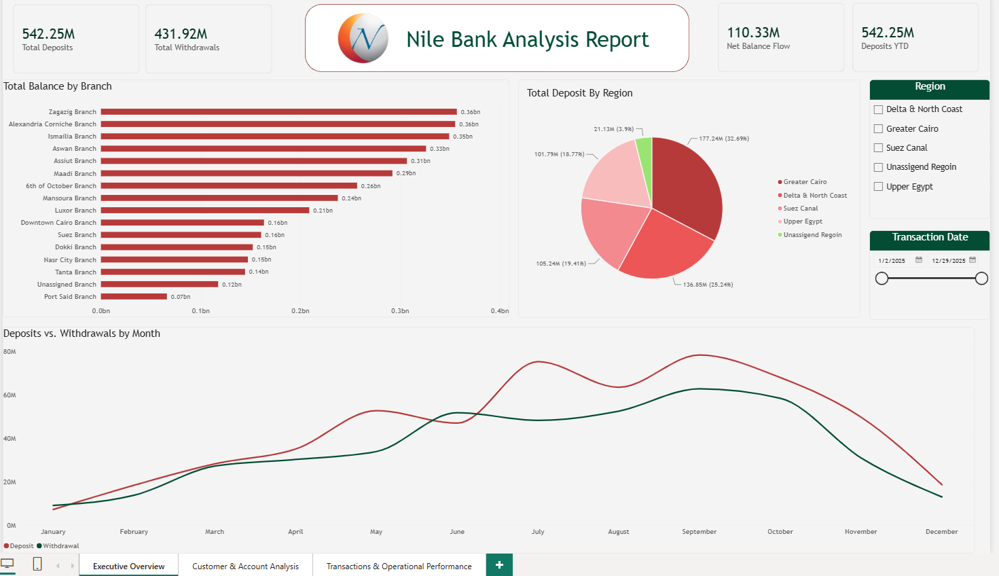
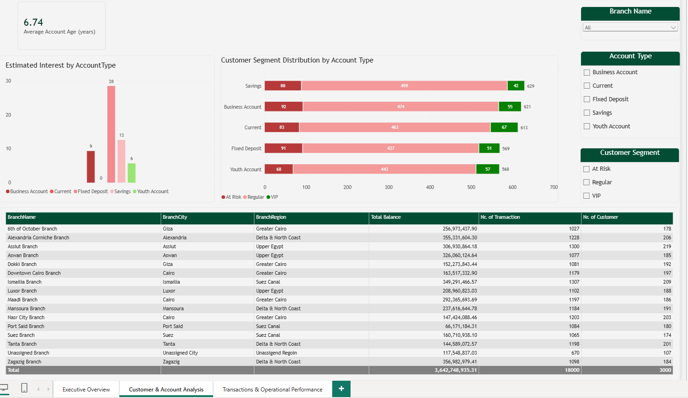
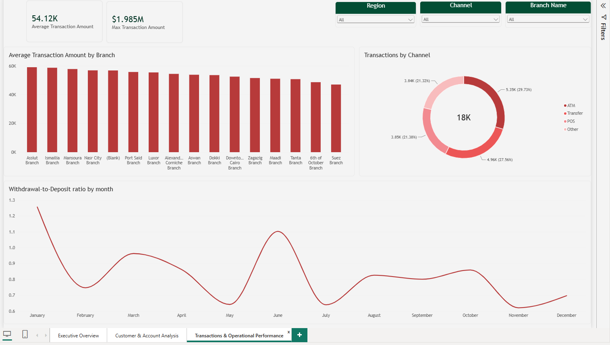

# -Nile_Bank_Analysis_Report

## 📊 Project Overview

An interactive Power BI dashboard developed to analyze Nile Bank's financial transactions, branch performance, customer behavior, and transaction channels throughout 2025.

The main goal of this project was to transform raw banking data into meaningful insights that can help management understand financial performance, customer behavior, and branch activity.

---

## 🎯 Project Objectives

The project aims to:

- Analyze total deposits and withdrawals.
- Monitor net balance flow and financial performance.
- Compare branch performance.
- Analyze customer behavior and transaction activity.
- Segment customers based on their transaction behavior.
- Analyze transaction channels and account types.
- Identify high-value and highly active customers.
- Answer key business questions using data analysis.
- Build an interactive dashboard for easier decision-making.

---

## 🛠️ Tools & Technologies

- **Microsoft Power BI**
- **Power Query**
- **M Language**
- **DAX**
- **Data Modeling**
- **Star Schema**
- **Power BI Service**
- **On-premises Data Gateway**

---

## 🔄 Data Cleaning & Transformation

The raw banking data was cleaned and transformed using **Power Query**.

The data preparation process included:

- Handling missing values.
- Removing and managing duplicate or inconsistent data.
- Correcting data types.
- Transforming and restructuring data.
- Creating calculated and derived fields.
- Preparing clean and analysis-ready tables.

---

## 🏗️ Data Modeling

A **Star Schema** data model was created to organize the data and support accurate analysis.

The model included tables related to:

- Customers
- Transactions
- Branches
- Account Types
- Transaction Channels

Relationships were created between the tables to allow accurate filtering and analysis across the dashboard.

---

## 📐 DAX Measures & KPIs

DAX measures were created to calculate key financial and analytical indicators, including:

- Total Deposits
- Total Withdrawals
- Net Balance Flow
- Deposits YTD
- Customer Count
- Average Transactions
- Branch Performance
- Account Type Analysis
- Transaction Analysis

Additional DAX calculations were used to support rankings, comparisons, customer segmentation, and business analysis.

---

## 👥 Customer Segmentation & Behavior

Customers were analyzed based on their transaction activity and behavior.

The analysis included customer segments such as:

- **VIP**
- **Regular**
- **At Risk**

The project also analyzed:

- Customer transaction activity.
- Account age.
- Transaction frequency.
- Transaction channels.
- Customer contribution to overall banking activity.

---

## 💼 Business Questions

The project addressed **20 business questions** covering different aspects of the bank's performance, including:

- Financial performance.
- Branch performance.
- Customer behavior.
- Account types.
- Transaction channels.
- Customer segmentation.
- Operational trends.

These questions were translated into analytical measures and visualizations to generate meaningful insights from the data.

---

## 📊 Dashboard Structure

The dashboard consists of **3 main pages**:

### 1. Executive Overview & KPIs

Provides a high-level overview of the bank's financial performance.

Key metrics and visuals include:

- Total Deposits
- Total Withdrawals
- Net Balance Flow
- Deposits YTD
- Monthly Deposits vs. Withdrawals
- Balance by Branch
- Interactive filters

---

### 2. Branch & Channel Performance

Focuses on analyzing branch performance and transaction channels.

This page allows users to:

- Compare branch performance.
- Analyze transactions by channel.
- Evaluate financial performance across branches.
- Explore branch and regional trends.

---

### 3. Customer Segmentation & Risk Analysis

Focuses on customer behavior and account activity.

The page provides insights into:

- Customer segments.
- Customer transaction activity.
- Account age.
- Transaction behavior.
- Highly active customers.
- Customers potentially at risk.

---

## 🎛️ Dashboard Interactivity

The dashboard includes interactive features such as:

- Slicers
- Cross-filtering
- Dynamic KPIs
- Interactive charts
- Data exploration across different dimensions

Users can interact with the dashboard to analyze the data from different perspectives.

---

## 🔄 Power BI Service & Data Gateway

The report was prepared for deployment through **Power BI Service**.

The project also included working with **On-premises Data Gateway** to support connectivity between the data source and the Power BI Service and prepare the report for scheduled data refresh.

---

## 💡 Key Insights

The analysis helped identify:

- Differences in financial performance between branches.
- Deposit and withdrawal trends over time.
- Customer segments based on transaction behavior.
- Highly active and high-value customers.
- Differences in transaction channel usage.
- Branches with stronger and weaker performance.
- Patterns in customer and account activity.

These insights provide a clearer understanding of the bank's financial activity, branch performance, and customer behavior.

---

## 📷 Dashboard Preview

### Executive Overview



### Customer & Account Analysis



### Transactions & Operational Performance



---

## 📁 Project Structure

```text
Nile-Bank-Performance-Customer-Analytics-PowerBI/
│
├── README.md
│
├── Nile_Bank_Dashboard.pbix
│
└── Screenshots/
    ├── ExecutiveOverview.PNG
    ├── Customer&AccountAnalysis.PNG
    └── Transactions&OperationalPerformance.PNG
